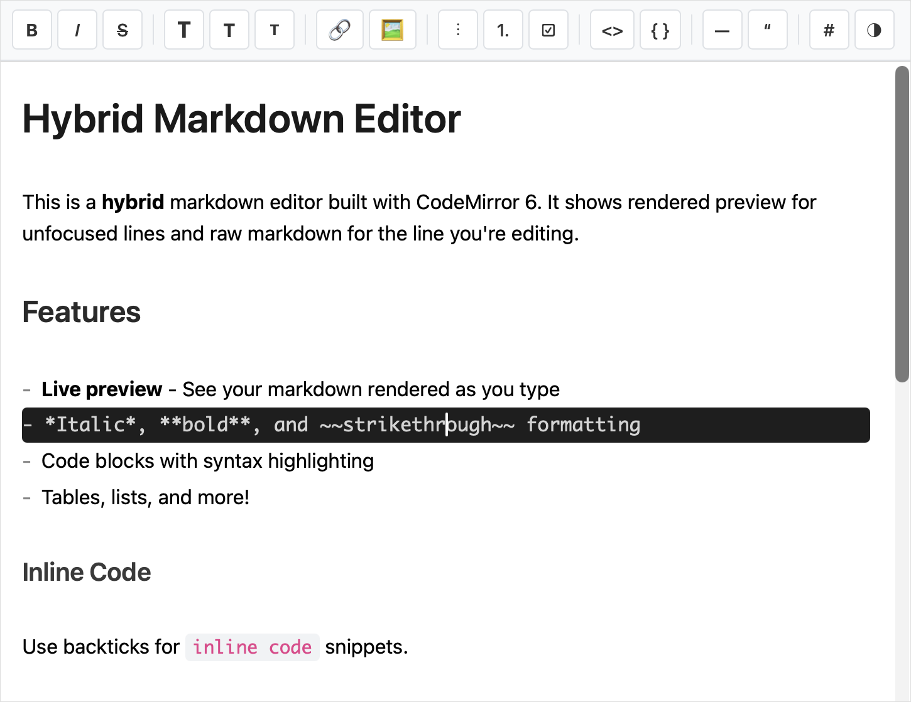

# codemirror-markdown-hybrid

A CodeMirror 6 extension for hybrid markdown editing - shows rendered preview for unfocused lines and raw markdown for the line being edited.

## Demo

Try it live: [**Live Demo**](https://tiagosimoes.github.io/codemirror-markdown-hybrid/)

<a href="https://tiagosimoes.github.io/codemirror-markdown-hybrid/">
  
</a>

## Install

```bash
npm install codemirror-markdown-hybrid
```

## Usage

```javascript
import { EditorState } from '@codemirror/state';
import { EditorView } from '@codemirror/view';
import {
  hybridMarkdown,
  toolbar,
  toggleTheme,
  toggleHybridMode,
} from 'codemirror-markdown-hybrid';

const state = EditorState.create({
  doc: '# Hello World',
  extensions: [
    hybridMarkdown({ theme: 'light' }),
    toolbar({
      onToggleTheme: toggleTheme,
      onToggleMode: toggleHybridMode,
    }),
  ],
});

const view = new EditorView({ state, parent: document.body });
```

## Features

- Hybrid preview - rendered markdown for unfocused lines, raw editing for current line
- Light and dark themes with dynamic switching
- Optional toolbar panel with formatting buttons
- Keyboard shortcuts (Ctrl+B, Ctrl+I, Ctrl+K, etc.)
- Syntax highlighted code blocks
- Tables, task lists, math (KaTeX), and more

## API

### `hybridMarkdown(options?)`

Main extension function. Returns an array of CodeMirror extensions.

| Option | Type | Default | Description |
|--------|------|---------|-------------|
| `theme` | `'light'` \| `'dark'` | `'light'` | Initial theme |
| `enablePreview` | `boolean` | `true` | Enable hybrid preview |
| `enableKeymap` | `boolean` | `true` | Enable markdown shortcuts |

### `toolbar(options?)`

Optional toolbar panel extension.

| Option | Type | Description |
|--------|------|-------------|
| `onToggleTheme` | `(view) => boolean` | Theme toggle callback |
| `onToggleMode` | `(view) => boolean` | Mode toggle callback |

### Helper Functions

- `toggleTheme(view)` - Toggle between light/dark themes
- `toggleHybridMode(view)` - Toggle between hybrid/raw mode
- `setTheme(view, theme)` - Set theme explicitly
- `setMode(view, mode)` - Set mode explicitly

## License

MIT
