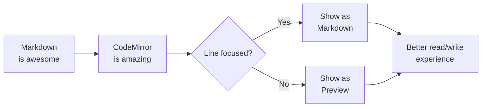

# Hybrid Markdown Editor

A [markdown](https://www.markdownguide.org/cheat-sheet/#basic-syntax) editor that shows the preview of the lines you aren't editing. No need to switch between edit and preview modes so much.

Check out the [repo](https://github.com/tiagosimoes/codemirror-markdown-hybrid) to use this in your projects.


## Features

- **Editable preview** - Click anywhere to edit that line or block using markdown
- *Italic*, **bold**, and ~~strikethrough~~ formatting
- Code blocks with syntax highlighting
- Tables, lists, and more!

### Inline Code

Use backticks for `inline code` snippets.

### Code Block

```javascript
function greet(name) {
  console.log(`Hello, ${name}!`);
}

greet('World');
```

### Lists

- Bullet list item 1
- Bullet list item 2
- Bullet list item 3

1. Numbered list item 1
2. Numbered list item 2
3. Numbered list item 3

### Task List

- [x] Completed task
- [ ] Incomplete task
- [i] Idea task
- [!] Urgent task
- [?] Question task
- [*] Important task
- [>] Forwarded task
- [<] Scheduled task

### Highlight, Subscript, Superscript

This is ==highlighted== text.

H~2~O and x^2^

### Heading IDs

#### Section Title [#section-title]

### Definition List

Term One
: First definition
: Second definition
  Continued detail line

### Footnotes

Here is a footnote reference[^note].

[^note]: This is the first line of the footnote.
  This line continues the footnote definition.

### Blockquote

> This is a blockquote. It can span multiple lines and contain **formatted** text.

### Links and Images

Check out [codemirror-markdown-hybrid](https://github.com/tiagosimoes/codemirror-markdown-hybrid) for more information


### Tags

Inline tags render as pills: #markdown #editor #codemirror/extension

Type `#` to trigger tag autocomplete.

### Wiki Links

See [[Project Plan]] for the roadmap.
Alias example: [[Meeting Notes|Latest sync]]
Section-only display: [[Research Notes#Open Questions]]
Section with alias: [[Release Checklist#Review|Preflight]]

### Tables

| Feature | Status | Notes |
|---------|--------|-------|
| Preview | Done | Works great |
| Themes | Done | Light and dark |
| Toolbar | Done | All buttons |

### Math (with KaTeX)

Inline math: $E = mc^2$

Block math:

$$
\frac{-b \pm \sqrt{b^2 - 4ac}}{2a}
$$

### Emoji

Supported emoji shortcodes: :smile: :heart: :rocket: :tada: :tent:

### Mermaid Diagrams



---

*Click on any line to edit it!*
