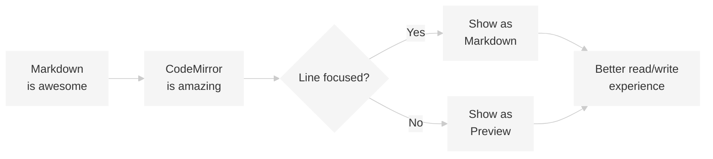

# Hybrid Markdown Editor

This is a **hybrid** markdown editor built with CodeMirror 6. It shows rendered preview for unfocused lines and raw markdown for the line you're editing.

## Features

- **Live preview** - See your markdown rendered as you type
- *Italic*, **bold**, and ~~strikethrough~~ formatting
- Code blocks with syntax highlighting
- Tables, lists, and more!

### Inline Code

Use backticks for `inline code` snippets.

### Code Block

```javascript
function greet(name) {
  console.log(`Hello, ${name}!`);
}

greet('World');
```

### Lists

- Bullet list item 1
- Bullet list item 2
- Bullet list item 3

1. Numbered list item 1
2. Numbered list item 2
3. Numbered list item 3

### Task List

- [x] Completed task
- [ ] Incomplete task
- [ ] Another task

### Blockquote

> This is a blockquote. It can span multiple lines and contain **formatted** text.

### Links and Images

Check out [CodeMirror](https://codemirror.net/) for more information.


### Tables

| Feature | Status | Notes |
|---------|--------|-------|
| Preview | Done | Works great |
| Themes | Done | Light and dark |
| Toolbar | Done | All buttons |

### Math (with KaTeX)

Inline math: $E = mc^2$

Block math:

$$
\frac{-b \pm \sqrt{b^2 - 4ac}}{2a}
$$

### Emoji

Supported emoji shortcodes: :smile: :heart: :rocket: :tada:

### Mermaid Diagrams



---

*Click on any line to edit it!*
